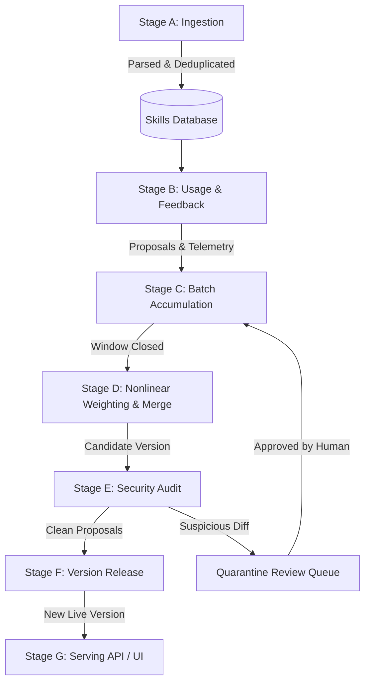

# 🌐 Unified Agentic Skill Manager

> **A living, evolutionary ecosystem for AI agent skills.**  
> Skills are treated like open-source libraries: shaped by real usage, nonlinearly weighted by unforgeable trust signals, audited for security, and versioned with full provenance.

---

## ⚡ Key Features & Highlights

- **Living Skill Evolution:** Skills are not static artifacts owned by a single author. They improve continuously through usage telemetry and community proposals.
- **Attention-Style Nonlinear Merge Weighting:**
  - **Redundancy Multiplier:** Independent proposals converging on the same fix multiply each other's influence logarithmically:
    $$\text{bonus} = \left(\sum \text{trust}_i\right) \times (1 + \ln(N) \cdot W_{\text{redundancy}})$$
  - **Disruptiveness Dampening:** Radical rewrites from unproven accounts are heavily dampened; established contributors retain latitude to make structural changes.
- **Unforgeable Trust Scoring:** Based on immutable track records (account maturity, verified star scale, prior accepted contributions) rather than gameable star metrics.
- **Defense-in-Depth Security Audit:**
  - **Static AST & Pattern Analysis:** Detects network calls, dangerous file system actions, code execution (`eval`/`exec`/`subprocess`), and safety overrides.
  - **Semantic Intent Diff Review:** Compares semantic divergence between live and candidate versions.
  - **Sandbox Canary Checks:** Evaluates code blocks for unwanted side effects.
  - **Sybil Timing Cluster Detection:** Identifies coordinated proposal clusters from nascent accounts.
- **Quarantine & Cherry-Picking:** Suspicious proposals are isolated into an Admin Review Queue while clean proposals merge without blocking the batch.
- **Append-Only Version Lineage:** Full provenance chain from root version to current live state.
- **Premium Glassmorphic SPA:** Dark mode UI with real-time pipeline controls, category breakdowns, proposal diffing, and audit telemetry.

---

## 🏗️ 7-Stage Pipeline Architecture



---

## 🚀 Quick Start

### 1. Run the Server
```bash
./run.sh
```
Or with custom environment:
```bash
source /home/shatix/venv-skm/bin/activate
cd backend
uvicorn app.main:app --host 0.0.0.0 --port 8000 --reload
```

Open **[http://localhost:8000](http://localhost:8000)** in your browser.

---

## 🧪 Running the End-to-End Verification Test

```bash
/home/shatix/venv-skm/bin/python3 backend/test_e2e.py
```

This script exercises all 7 pipeline stages from scratch:
1. Seeds 10 curated skills across categories.
2. Simulates skill execution and usage telemetry.
3. Submits 3 proposals with differing trust profiles (Veteran, Moderate corroborator, Newcomer disruptive).
4. Clusters proposals and executes nonlinear weighting and merge synthesis.
5. Performs security audit passes.
6. Releases clean candidate to live version with full parent-child lineage.
7. Simulates a malicious injection attack and verifies quarantine isolation.

---

## 📡 API Reference Overview

| Route | Method | Description |
|---|---|---|
| `/api/skills/` | GET | List skills with category filter & search |
| `/api/skills/{id}` | GET | Get skill details & current version |
| `/api/skills/{id}/use` | POST | Log skill usage telemetry |
| `/api/skills/{id}/versions` | GET | Full version history chain |
| `/api/proposals/skills/{id}/proposals` | POST | Submit content modification or issue |
| `/api/batches/process` | POST | Force close batch & generate merge candidate |
| `/api/audit/batch/{id}/audit` | POST | Run static analysis, canary, and sybil audit |
| `/api/audit/batch/{id}/release` | POST | Promote audited candidate to live version |
| `/api/audit/pipeline/{id}/run-full` | POST | End-to-end batch → audit → release pipeline |
| `/api/audit/quarantined` | GET | View quarantined suspicious proposals |
| `/api/audit/proposal/{id}/review` | POST | Admin approve/reject quarantined proposal |
| `/api/audit/stats` | GET | Global analytics & telemetry metrics |
| `/api/ingestion/seed` | POST | Ingest curated demo skill sets |

---

## ⚙️ Configuration & Tunables (`app/config.py`)

All parameters are configurable via environment variables (`SKM_*` prefix):

```ini
SKM_DATABASE_URL=sqlite:///./skill_manager.db
SKM_BATCH_WINDOW_HOURS=24.0
SKM_BATCH_MAX_PROPOSALS=100
SKM_REDUNDANCY_TRUST_MULTIPLIER=1.5
SKM_DISRUPTIVENESS_LOW_TRUST_DAMPENER=0.7
SKM_DISRUPTIVENESS_HIGH_TRUST_DAMPENER=0.2
SKM_AUDIT_RISK_THRESHOLD=0.7
SKM_SYBIL_ACCOUNT_AGE_THRESHOLD_DAYS=30
SKM_LLM_PROVIDER=mock  # or "openai"
```
