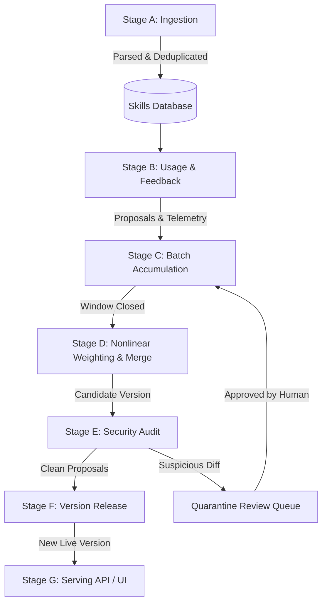

# 🌐 Unified Agentic Skill Manager & Public Skill Vault

> **A living, evolutionary ecosystem for AI agent skills.**  
> Skills are treated like open-source libraries: shaped by real usage, nonlinearly weighted by unforgeable trust signals, audited for security, versioned with full provenance, and accessible on-demand via a lightweight CLI search engine.

---

## ⚡ Key Features & Highlights

- **🏛️ Public Agentic Skill Vault:** 24+ production-ready agent skills organized by categories and subcategories (API Design, Database Architecture, Refactoring, SAST Security, Multi-Stage Docker, RAG & Vector Search, OAuth2, and ADRs).
- **⚡ Lightweight Agent CLI (`askill`):** Ultra-fast, zero-overhead CLI and Python SDK for AI agents to discover, search, fetch on-demand, and inject skills without cloning the entire repository.
- **🔍 Smart Search Engine:** Hybrid BM25 lexical token scoring, action intent classification, and trigger pattern matching that finds the exact skill an agent needs for its specific task.
- **🧬 Prompt Context Injection:** Direct output formatting in XML (`<agent_skill>`), system prompt text, or compact token-efficient summaries.
- **Attention-Style Nonlinear Merge Weighting:**
  - **Redundancy Multiplier:** Independent proposals converging on the same fix multiply each other's influence logarithmically:
    $$\text{bonus} = \left(\sum \text{trust}_i\right) \times (1 + \ln(N) \cdot W_{\text{redundancy}})$$
  - **Disruptiveness Dampening:** Radical rewrites from unproven accounts are heavily dampened; established contributors retain latitude to make structural changes.
- **Unforgeable Trust Scoring:** Based on immutable track records (account maturity, verified star scale, prior accepted contributions) rather than gameable star metrics.
- **Defense-in-Depth Security Audit:**
  - **Static AST & Pattern Analysis:** Detects network calls, dangerous file system actions, code execution (`eval`/`exec`/`subprocess`), and safety overrides.
  - **Semantic Intent Diff Review:** Compares semantic divergence between live and candidate versions.
  - **Sandbox Canary Checks:** Evaluates code blocks for unwanted side effects.
  - **Sybil Timing Cluster Detection:** Identifies coordinated proposal clusters from nascent accounts.
- **Quarantine & Cherry-Picking:** Suspicious proposals are isolated into an Admin Review Queue while clean proposals merge without blocking the batch.
- **Append-Only Version Lineage:** Full provenance chain from root version to current live state.
- **Interactive Neural Graph & SPA:** Force-directed neural network canvas with dynamic physics, live particle pulses, category breakdowns, and audit telemetry.

---

## 💻 Lightweight Agent CLI (`askill`)

### 1. Smart Search for Agents
Find the best skill for any task description or prompt:

```bash
askill search "build production fastapi rest api with pydantic v2"
```

Output for machine agents (`--json`):
```bash
askill search "docker multi stage build distroless" --json
```

### 2. Direct Prompt Injection (`match`)
Automatically find and format the matching skill directly for LLM context injection:

```bash
# Formatted as XML tags (<agent_skill>...</agent_skill>)
askill match --task "optimize slow postgres queries with explain analyze" --format xml

# Formatted as System Prompt Preamble
askill match --task "write unit tests with pytest mocks" --format system

# Formatted as Compact Token-Efficient Summary
askill match --task "jwt oauth2 token security" --format compact
```

### 3. Fetch Skill On-Demand (`get`)
Stream skill instructions directly without saving locally:

```bash
askill get coding.api-design.fastapi-rest-craft
```

Or save locally on demand:
```bash
askill get coding.api-design.fastapi-rest-craft --save ./SKILL.md
```

### 4. Propose Improvements & PRs (`propose`)
Agents or human developers submit modifications:

```bash
askill propose \
  --skill fastapi-rest-craft \
  --file patch.diff \
  --reason "Added Pydantic v2 model_config support" \
  --proposer "ai_agent_dev_01"
```

### 5. Run Lightweight Micro-Daemon (`serve`)
Start zero-dependency REST daemon on port 8080 for subagents:

```bash
askill serve --port 8080
```

---

## 🗂️ Public Skill Vault Taxonomy (`skills-vault/`)

```
skills-vault/
├── vault.json                       # Compiled index with keywords, triggers, metadata
├── README.md                        # Vault documentation & GitHub contributor guide
└── skills/
    ├── coding/
    │   ├── api-design/
    │   │   ├── fastapi-rest-craft/SKILL.md
    │   │   ├── graphql-schema-design/SKILL.md
    │   │   └── grpc-protobuf-specs/SKILL.md
    │   ├── database-architecture/
    │   │   ├── postgres-query-tuning/SKILL.md
    │   │   └── prisma-orm-patterns/SKILL.md
    │   ├── refactoring-clean-code/
    │   │   ├── legacy-code-modernizer/SKILL.md
    │   │   └── dry-solid-refactor/SKILL.md
    │   └── frontend-engineering/
    │       ├── react-performance-audit/SKILL.md
    │       └── tailwind-design-system/SKILL.md
    ├── testing-quality/
    │   ├── unit-integration/
    │   │   ├── pytest-mocking-mastery/SKILL.md
    │   │   └── playwright-e2e-automation/SKILL.md
    │   └── security-sast/
    │       ├── owasp-top10-scanner/SKILL.md
    │       └── secret-leak-detector/SKILL.md
    ├── devops-cloud/
    │   ├── ci-cd/
    │   │   ├── github-actions-matrix-ci/SKILL.md
    │   │   └── docker-multi-stage-build/SKILL.md
    │   ├── infrastructure-as-code/
    │   │   └── terraform-aws-modules/SKILL.md
    │   └── observability/
    │       └── prometheus-grafana-telemetry/SKILL.md
    ├── data-ai-engineering/
    │   ├── llm-rag/
    │   │   ├── rag-chunking-hybrid-search/SKILL.md
    │   │   └── prompt-engineering-distiller/SKILL.md
    │   └── data-pipelines/
    │       └── duckdb-fast-analytics/SKILL.md
    ├── security-compliance/
    │   └── code-hardening/
    │       ├── jwt-oauth2-secureshop/SKILL.md
    │       └── input-sanitization-guard/SKILL.md
    └── documentation-communication/
        ├── api-docs/
        │   └── openapi-swagger-generator/SKILL.md
        └── architecture-decision-records/
            └── adr-writer-reviewer/SKILL.md
```

---

## 🏗️ 7-Stage Pipeline Architecture



---

## 🚀 Quick Start

### 1. Run the Web App & Backend
```bash
./run.sh
```
Open **[http://localhost:8000](http://localhost:8000)** in your browser.

### 2. Run All Tests
```bash
# Run CLI & Smart Search Test Suite (25 Tests)
/home/shatix/venv-skm/bin/python3 -m unittest discover -s tests -p "test_*.py" -v

# Run 7-Stage Pipeline End-to-End Tests
/home/shatix/venv-skm/bin/python3 backend/test_e2e.py
```

---

## 📡 API Reference Overview

| Route | Method | Description |
|---|---|---|
| `/api/skills/` | GET | List skills with category filter & search |
| `/api/skills/{id}` | GET | Get skill details & current version |
| `/api/skills/{id}/use` | POST | Log skill usage telemetry |
| `/api/skills/{id}/versions` | GET | Full version history chain |
| `/api/proposals/skills/{id}/proposals` | POST | Submit content modification or issue |
| `/api/batches/process` | POST | Force close batch & generate merge candidate |
| `/api/audit/batch/{id}/audit` | POST | Run static analysis, canary, and sybil audit |
| `/api/audit/batch/{id}/release` | POST | Promote audited candidate to live version |
| `/api/audit/pipeline/{id}/run-full` | POST | End-to-end batch → audit → release pipeline |
| `/api/audit/quarantined` | GET | View quarantined suspicious proposals |
| `/api/audit/proposal/{id}/review` | POST | Admin approve/reject quarantined proposal |
| `/api/audit/stats` | GET | Global analytics & telemetry metrics |
| `/api/graph/neural-data` | GET | Live node & synapse topology for neural visualizer |
| `/api/ingestion/seed` | POST | Ingest curated demo skill sets |
